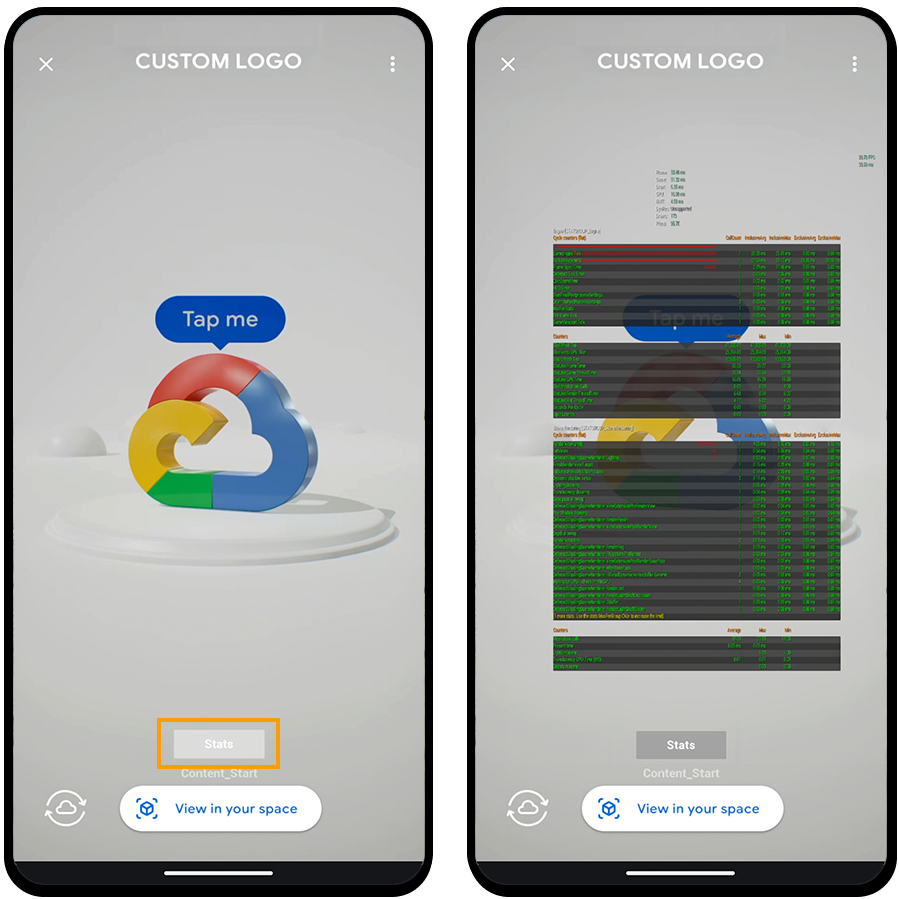

# Immersive Stream for XR

This repository contains a template that can be used to
start development with Immersive Stream for XR.

#### Table of Contents
1. [Getting Started](#getting-started)
2. [Content Guidelines for 3D and AR creators](#content-guidelines-for-3d-and-ar-creators)
3. [Demo Features and Templates](/Unreal_Template_Project/README.md#demo-features-and-templates)

For information about Immersive Stream for XR, quickstart guide and additional documentation visit
[cloud.google.com/immersive-stream/xr](https://cloud.google.com/immersive-stream/xr)

_Google does not charge for access to Unreal Engine®, which is
subject to the Unreal Engine® End User License Agreement._

_________________________________________________________________________________________

## Getting Started

### Immersive Stream for XR + Unreal Engine

Choose your path to get started with Immersive Stream for XR:

A. [Template Project](/Unreal_Template_Project)\
B. [Minimal Integration](/Unreal_Minimal_Integration)

_Both paths use [Unreal Engine®](https://cloud.google.com/immersive-stream/xr/docs/about-unreal) 5.0.3._
_______________________________________________________________________________________

## Content guidelines for 3D and AR creators

Immersive Stream for XR currently supports **Unreal Engine®**. We recommend optimizing your content and project settings for the experience to always run at 30FPS and load in 2 seconds or less in both 3D and AR mode when deployed in the cloud. This helps the experience run smoothly and avoid crashes.

At the moment we do not provide runtime logs, but you can view the stats on screen and use other [Unreal® Engine tools for testing and optimization](https://docs.unrealengine.com/5.0/en-US/testing-and-optimizing-your-content/).

You can find more information on stat commands in the [Unreal Engine® documentation](https://docs.unrealengine.com/5.0/en-US/stat-commands-in-unreal-engine/).

### Testing Locally

Immersive Stream for XR runs on Linux + Vulkan.
In the Project settings change the platform's *Default RHI* to *Vulkan*
to replicate the expected final look in Unreal Editor when developing in other platforms.

To test if a Linux build succeeds locally, install the
[Cross-Compile Toolchain](https://docs.unrealengine.com/5.0/en-US/linux-development-requirements-for-unreal-engine/)
and trigger a build using Linux as the desired platform.

### Landscape mode

Immersive Stream for XR is optimized to display experiences in portrait mode on
mobile and desktop devices but can be viewed in landscape aspect ratios as well.

Immersive Stream for XR doesn't support fully responsive UI yet, but you can turn on a
different UI for Landscape aspect ratio.

### Debug Mode

In the template you can enable **Debug mode** in the **XR_Init** blueprint. This displays a button that toggles the stats on screen on and off.

_Note: The scale of the stats screen when debug mode is enabled is determined by the
camera's FOV. The larger the FOV, the smaller the stats. For example, this
capture uses the default value of `40deg`_

By default these are the stat commands that will be displayed:

* `stat FPS`
* `stat Unit`
* `stat Engine`
* `stat SceneRendering`

You can add more commands in the **Debug Stats Command** list in the **XR_Init** blueprint within the persistent level.

### Optimization Suggestions

Here area few suggestions to optimize your project if it is not running smoothly at 30FPS on ISXR:
* **Meshes:** Enable Nanite or use LODs when needed.
* **Textures:** Limit the total size of all loaded textures and the maximum dimensions of each texture.
* **Map size:** Optimize file sizes to avoid an increase in loading times. To check the size of your maps in Unreal® Editor, use the right-click menu of the level umap and then select Size Map.
* **Shadows:** Disable dynamic shadow casting for meshes that do not contribute much to the shadow and limit the number of light sources that cast dynamic shadows.
* **Lighting:** Nanite is enabled by default. Balance the use of dynamic and static lighting.
* **Render times:** Analyze the statistics of a rendered frame in Unreal® Editor by positioning the camera to show the full model, running the `r.AllowOcclusionQueries 0` console command to avoid GPU object culling and using:
  * `stat RHI`
  * `stat GPU`

**Other suggestions:**
* Keep asset names to a maximum of 30 characters.
* Limit the number of planar reflection planes.
* Bake any textures that you use from [Substance](https://www.substance3d.com) or any other dynamic plugins.
* Use Surface *ForwardShading* as the lighting mode for translucent materials.

_Note: Hardware raytracing is currently not supported._

### Adding Audio

Audio can be added to the experience using the standard Unreal Engine process.

When creating the launch URL for the experience make sure you check the **Enable audio** option.

_Note: Currently audio works in the web client only._

### Adding Videos

The experience is run using Linux and Vulkan, so the supported type of video
formats are:

* Image sequence
* WebM

_Note: Remember to include the movie files during packaging. You can configure
this in the **Project Settings** > **Packaging** section._

### Orientation

#### Rotation
For the assets to face the camera at the start of the experience when using
the default camera setup,  rotate the assets to face the -X axis. The 3D
default pawn starts with a 45 deg rotation in Z.

### Limitations

#### Plugins
Immersive Stream for XR currently only supports custom plugins at the Unreal Engine®
project level located in the `Plugins` subfolder.
We support most standard UE5 engine plugins except for the Bridge plugin.
Project plugins either need to be prebuilt for Linux or will be built
as part of building the Content resource you create. The latter requires the upload of the source files of the plugin.

##### Bridge Plugin
If your project uses Quixel assets imported using the [Bridge Plugin](https://help.quixel.com/hc/en-us/sections/360005846137-Quixel-Bridge-for-Unreal-Engine-5),
make sure you move or copy and relink the `Engine/Plugins/Bridge Content/MSPresets`
folder into your `Content` folder to avoid missing materials.

_Note: To do this in the editor, change the **Content Browser** settings to `Show Engine Content` and `Show Plugin Content`._

Test the assets load correctly by disabling the **Bridge Plugin** and reloading your project.
