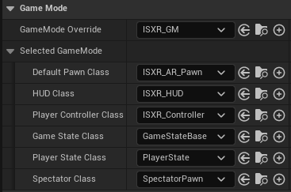
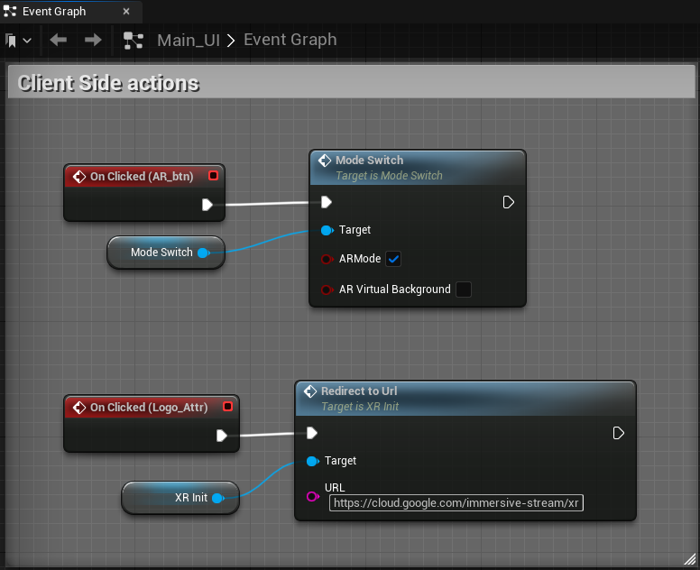
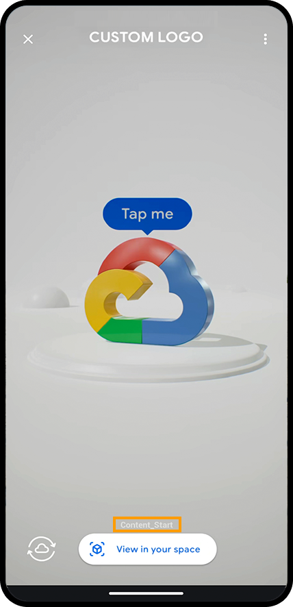
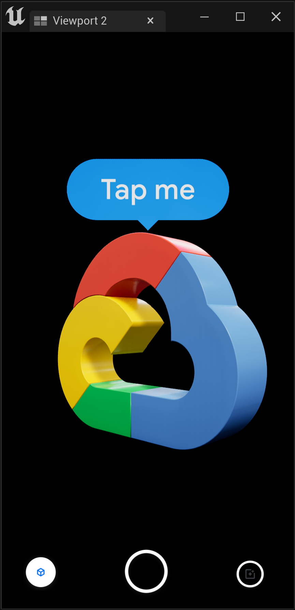
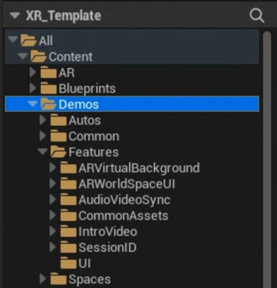
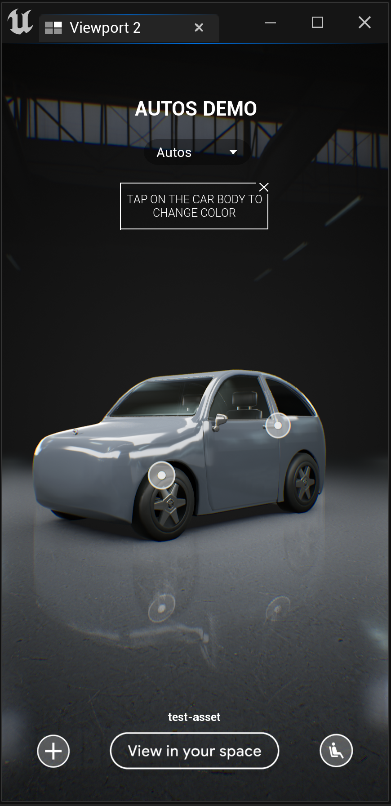
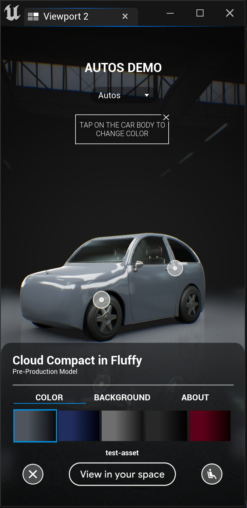
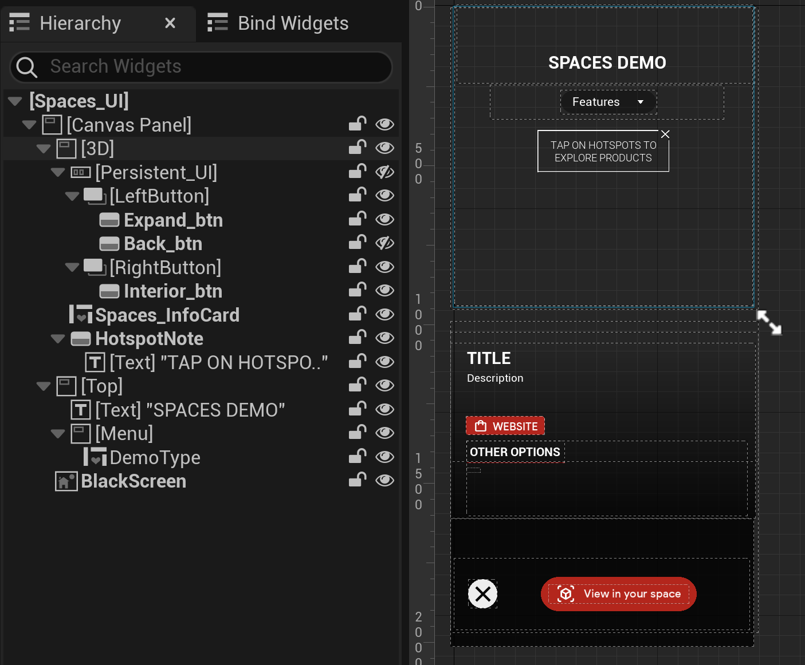

# Immersive Stream for XR

This repository contains a template that can be used to
start development with Immersive Stream for XR.

#### Table of Contents
1. [Getting Started](#getting-started)
2. [Content Guidelines for Creators](#content-guidelines-for-creators)
3. [Unreal Template Project](#unreal-template-project)
3. [Unreal Minimal Integration](#unreal-minimal-integration)
4. [Demo Features and Templates](#demo-features-and-templates)

For information about Immersive Stream for XR, quickstart guide and additional documentation visit
[cloud.google.com/immersive-stream/xr](https://cloud.google.com/immersive-stream/xr)

_Google does not charge for access to Unreal Engine®, which is
subject to the Unreal Engine® End User License Agreement._

_________________________________________________________________________________________

## Getting Started

### Immersive Stream for XR + Unreal Engine®

Choose your path to get started with Immersive Stream for XR.

A. Start using the ISXR [Template Project](#unreal-template-project)\
B. Integrate ISXR into your existing project: [Minimal Integration](#unreal-minimal-integration)

_Both paths use [Unreal Engine®](https://cloud.google.com/immersive-stream/xr/docs/about-unreal) 5.3.2._

#### Engine and Template Compatibilty

Unreal Engine® version | Template version
-----------------------|------------------------|
5.3.2                  | 3.0.0                  |

If the versions are not compatible the build logs will show this error and the content will not be built:
_`Major builder and template versions don't match (#.#.# vs. #.#.#). Aborting build.`_

_Important note: For cloud builds to work make sure that the **CHANGELOG.md** file is included in the root folder of your cloud content source bucket._
_______________________________________________________________________________________

## Content Guidelines for Creators

Immersive Stream for XR currently supports **Unreal Engine®**. We recommend optimizing your content and project settings for the experience to always run at 30FPS and load in 2 seconds or less in both 3D and AR mode when deployed in the cloud. This helps the experience run smoothly and avoid crashes.

At the moment we do not provide runtime logs, but you can view the stats on screen and use other [Unreal® Engine tools for testing and optimization](https://docs.unrealengine.com/5.3/en-US/testing-and-optimizing-your-content/).

### Testing Locally

Immersive Stream for XR runs on Linux + Vulkan.
In the Project settings change the platform's *Default RHI* to *Vulkan*
to replicate the expected final look in Unreal Editor when developing in other platforms.

To test if a Linux build succeeds locally, install the
[Cross-Compile Toolchain](https://docs.unrealengine.com/5.3/en-US/linux-development-requirements-for-unreal-engine/)
and trigger a build using Linux as the desired platform.

### Debug Mode

In the template you can enable **Debug mode** in the **ISXR_Init** blueprint. This displays a button that toggles the stats on screen on and off.

_Note: The scale of the stats screen when debug mode is enabled is determined by the
camera's FOV. The larger the FOV, the smaller the stats. For example, this
capture uses the default value of `40deg`_

You can modify the commands in the **Debug Stats Command** list in the **ISXR_Init** blueprint within the main level.

### Optimization Suggestions

Here area few suggestions to optimize your project if it is not running smoothly at 30FPS on ISXR:
* **Meshes:** Enable Nanite or use LODs when needed.
* **Textures:** Limit the total size of all loaded textures and the maximum dimensions of each texture.
* **Map size:** Optimize file sizes to avoid an increase in loading times. To check the size of your maps in Unreal® Editor, use the right-click menu of the level umap and then select Size Map.
* **Shadows:** Disable dynamic shadow casting for meshes that do not contribute much to the shadow and limit the number of light sources that cast dynamic shadows.
* **Lighting:** Lumen is enabled by default. Balance the use of dynamic and static lighting.
* **Render times:** Analyze the statistics of a rendered frame in Unreal® Editor by positioning the camera to show the full model, running the `r.AllowOcclusionQueries 0` console command to avoid GPU object culling and using:
  * `stat RHI`
  * `stat GPU`

**Other suggestions:**
* Keep asset names to a maximum of 30 characters.
* Limit the number of planar reflection planes.
* Bake any textures that you use from [Substance](https://www.substance3d.com) or any other dynamic plugins.
* Use Surface *ForwardShading* as the lighting mode for translucent materials.

### Adding Audio

Audio can be added to the experience using the standard Unreal Engine process.

When creating the launch URL for the experience make sure you check the **Enable audio** option.

### Adding Videos

The experience is run using Linux and Vulkan, so the supported type of video
formats are:

* Image sequence
* WebM

_Note: Remember to include the movie files during packaging. You can configure
this in the **Project Settings** > **Packaging** section._

### Current Limitations

#### General
* Audio works in the web client only.
* Hardware raytracing is not supported.
* Fully responsive UI is not supported yet.
* Screen space UI in 3D mode only.

#### Plugins
Immersive Stream for XR currently only supports custom plugins at the Unreal Engine®
project level located in the `Plugins` subfolder.
We support most standard UE5 engine plugins except for the Bridge plugin.
Project plugins either need to be prebuilt for Linux or will be built
as part of building the Content resource you create. The latter requires the upload of the source files of the plugin.

##### Bridge Plugin
If your project uses Quixel assets imported using the [Bridge Plugin](https://help.quixel.com/hc/en-us/sections/360005846137-Quixel-Bridge-for-Unreal-Engine-5),
make sure you move or copy and relink the `Engine/Plugins/Bridge Content/MSPresets`
folder into your `Content` folder to avoid missing materials.

_Note: To do this in the editor, change the **Content Browser** settings to `Show Engine Content` and `Show Plugin Content`.Test the assets load correctly by disabling the **Bridge Plugin** and reloading your project._

_______________________________________________________________________________________

## Unreal Template Project

To get started with Immersive Stream for XR, you can download this template project that
includes all the required settings for you to begin.

### Features

This template project supports the following features:

* Switch between 3D and AR modes.
* Fully customizable UI and events triggered within Unreal Engine®.
* Pre-made events [Mode Switch, Trigger in AR, Trigger in 3D].
* Pre-made client trigger events [Switch to AR Mode, Redirect to URL, Change Cloud AR Asset ID].
* Fully customizable pre-set gesture controlled camera for 3D mode.
* Touch in world space for 3D and AR.
* Debug mode with toggle stats option.
* Preview support in the editor.
* Configurable bounding box scale for AR placement.
* Asset ID definition to set starting map or session ID using the entrypoint URL.
* Upload by running a script [SyncContent.ps1].

#### Modes
Immersive Stream for XR supports both 3D and AR modes. There are some differences between their features:

3D mode                | AR mode
-----------------------|------------------------|
Screen space UI        | World space UI         |
Custom camera controls | Pre-set camera controls|
Background switching   | `AR_BG` + camera feed  |

### Setup and Content Overview

The startup level is `ISXR_Main` which includes everything required for the experience to work.

* `ISXR_Init` blueprint
* Game Mode: `ISXR_GM`
* Starter demo assets and levels

##### Blueprints
The template project includes the following blueprints that shouldn't be removed, renamed or modified:

* `ISXR_Init` : Contains all the startup logic.
* `ModeSwitch` : Manages switch between 3D and AR modes.
* `SideChannel` : Manages client-server events and is replaced during the cloud build.
* `AR_Lights` : Contains the AR lighting logic and is replaced during the cloud build.

#### Game Mode
The project uses `ISXR_GM` as the default game mode, which is required for
the starting pawn and UI to load correctly.

#### Loading Assets Before the User Connects
There is a signal that can be sent from the game to let the client know that it is ready for streaming.
A game server will not become available for serving unless this signal is received.
By default this signal is sent in the `ISXR_Init` blueprint when the console variable `r.C9.ReadyToStream` is set to 1.

To change this, remove this variable from the `InitCommands` list and trigger it when all the assets are loaded.

_Note: If this signal is not sent, the stream will not start._

### Interactions

#### Touch Events
We support touch events in Unreal Engine®. You can set this up in the
`DefaultInput.ini` config file. The template includes a few examples of touch
events:

*  `TouchExample_BP` has a simple example of how you can set up an event trigger
   by tapping on an object.
*  `ISXR_3D_Pawn` shows how you can use pinch, tap,
   and slide gestures to control the camera.

#### Server to Client Events
From the Unreal® project on the server side, you can trigger the following events
on the client side:

* `Mode Switch` : With the **AR Mode** option checked it triggers the switch from 3D to AR mode.
* `Redirect to URL` : Opens the specified website on the client side.
* `Change Cloud AR Asset ID` : Modifies the asset ID used in the entrypoint URL. [Learn more.](change-cloud-ar-asset-id)

In the Unreal® Editor **Switch to AR Mode** triggers a simplified preview
and **Redirect to URL** prints out the specified URL to screen.

You can find examples of how these events are set up in the `Main_UI`
widget blueprint and in the Features Session ID demo.

##### Change Cloud AR Asset ID
To modify the Cloud AR asset ID you can use `ChangeCloudARAssetID_Dispatch`.
This Modifies the asset ID used in the entrypoint URL.
This could be used for example to assign a session code to save an asset customization.

Note that the session ID is included in the asset ID in this format _Default:`Session_ID:`###_.

#### Camera Controls
We use two different types of camera controls for 3D and AR modes:

* 3D mode uses a custom pawn called `ISXR_3D_Pawn` that controls the camera
  by default.
* AR mode uses a camera controlled on the client side so you can't modify these
  controls, but you can configure the starting location and orientation. See
  [AR camera customization](ar-camera-customization) for details.

The `ISXR_3D_Pawn` is set up to orbit around an object and contains a camera
and spring arm.

Some values are exposed for easier customization:

* `Camera Distance`
* `Min Cam Distance`
* `Max Cam Distance`
* `Swipe Speed`
* `Pinch Scale`

#### Startup Customization

On startup, we pass a customizable parameter from the client-side to
Unreal Engine® that can be used to do the following operations. For example:

* Load different levels per different entry points using a customized intent
  URL.
* Load a configuration from a previous session.
* Show customized messages.

The `GetCloudARAssetID` event in the `ISXR_Init` blueprint is called on
startup with an `AssetID` string parameter equal to the value of the
`cloudARAssetID` parameter that you used in the URL to launch the experience.

You can preview the value for `cloudArAssetId` above the **View in your space**
button:

For example, the URL could contain the following:

    intent://arvr.google.com/scene-viewer/...cloudArAssetId=ISXR_Main...;end

In Unreal® Editor, by default the value of the `CloudARAssetID` variable is:
`Default:Session_ID:000`.

We added a two examples. Example A switches the starting asset and Example B switches the starting persistent map to the Demos.

From here, you can customize the actions in Unreal Engine® based on the asset
ID received from the intent.

_Warning: This parameter in the intent is customizable to any value you like, but
it cannot be empty._

### UI Customization

#### Main UI

Immersive Stream for XR allows for screen space UI in 3D mode only.
In AR mode, you can add any UI as world space UI, similar to the standard approach to UI in VR games.

Everything in the `Main_UI` widget will be present in the built experience.

#### Landscape Mode
Immersive Stream for XR doesn't support fully responsive UI yet, but you can use a pre made event, **SetUIOrientation** or the **SetUIOrientation_Dispatch** to turn on a different UI for landscape or modify UI components' scale based on the aspect ratio.

#### AR UI in Editor Preview

You can preview the AR UI in the Unreal® Editor viewport by simulating or playing from the `ISXR_Main.umap`
and clicking on the **View in your space** button. Currently the screen space UI in AR mode cannot be modified.

### AR Mode

Enable AR mode by checking the `AR Mode Enabled` checkbox in the `ISXR_Init` blueprint.

If AR mode is enabled you'll be able to use the `ModeSwitch` event to switch between 3D and AR modes.

With **AR Mode** checked it:
* Changes the active pawn to the `AR_Pawn`.
* Deactivates the pawn being used in 3D mode.
* Loads the `AR_BG` level.
* Hides streaming levels selected in the `Hide in AR` level list exposed in the `ISXR_Init` blueprint.
* Calls the `Trigger in AR` dispatcher.
* If the `AR Virtual Background` box is checked, `AR_BG` is not loaded and the levels listed to unload in `ISXR_Init` are ignored.
This is useful if you want to have a virtual background with AR navigation. See the `ARVirtualBackground` example in the Features demo.

With **AR Mode** un-checked it:
* Changes the active pawn to the one used in 3D mode.
* Destroys the `AR_Pawn`.
* Unloads the `AR_BG` level.
* Unhides streaming levels selected in the `Hide in AR` list.
* Calls the **Trigger in 3D** dispatcher.

#### AR_BG Level

When switching to AR mode the `AR_BG` level is loaded.
This level contains the lighting setup to view the user's camera feed in the background.

Lighting in AR mode is static by default and set to be fixed with the user's environment, even if they rotate the objects.
In the Unreal® Editor, the static lighting blueprint has a skylight and directional light `ARLighting_Static`.

_Warning: Don't remove the existing assets in the `AR_BG` map or add any dynamic
lights in it._

#### Assets and Background Split for AR Mode

When creating a project that includes AR mode, assets and background need to be split to be able to unload the 3D virtual background in AR mode to replace it with the user's camera stream.

The best way to do this is placing the assets that are visible in both 3D and AR modes in the main map, and loading backgrounds as separate streaming levels.

The background streaming levels need to be listed in the `Hide in AR` level list exposed in the `ISXR_Init` blueprint to be hidden in AR mode.

_Note: For faster transitions between modes, set all streaming levels to be
initially loaded._

##### Alpha in AR Mode

For virtual assets to better integrate into the user's camera feed, in AR mode we process alpha in a special way.
For this to work, please avoid rendering custom depth passes for geometry.
The `Render CustomDepth Pass` value should be set to `False` (_note that `False` is the default value_).

#### AR Camera Customization
In AR mode, you can customize:

* `Start location`
* `Start orientation`
* `Teleporting functionality`

To modify the AR start location and orientation, edit the `ARStartAnchor` asset
in the `AR_BG` map. You can modify the yaw orientation and XY location
values; however, Z (height) and pitch/roll are restricted.

In use cases where the world surrounds the user and there is no need
for a pivot point, you can configure teleporting by using the `ARTeleport` function
to move the camera to a given position/orientation by adding a camera in the
scene and inheriting the position/orientation from it.

Note that when moving or rotating the object in AR,
the teleport function causes the pivot point of the scene to not coincide with the origin.

For example:

_Note: The preview is for design purposes and will not display the exact camera
pose._

#### AR Bounding Box

_Note: Customizing the AR bounding box is supported starting from the latest versions of the Google App (275.0.550423587 and 14.31.21).\
Please update the Google App on your device before using this feature._

When placing objects in AR mode it is important to define a bounding box according to the object's scale.
Increasing or decreasing the bounding box size results in the object to be initially placed farther or closer respectively.\
Like in Unreal, where one unit equals one meter, the units for the AR bounding box size are in meters.

You can visualize the AR bounding box in Unreal Editor.

_Note: This asset is visible in editor only._

Creators have two ways of modifying the bounding box:

1. Set the bounding box scale value for the whole project in the `ISXR_Init` settings.\
This is useful in projects where only assets of a similar size are placed in AR mode.

2. Modify the bounding box value on a specific event in the experience using the
`UpdateBoundingBoxSize` event.

#### AR Visual Guidance

We added the `AR_Guidance_bp` blueprint in the `AR_BG` level that provides visual indication
for users to move around when they point their device away from the main virtual asset.

To use this, set the actor class of the object you want to use as the center of attention in
the `AR_Guidance_bp` Event Graph.

_______________________________________________________________________________________

## Unreal Minimal Integration

To easily make an existing Unreal Engine project compatible with Immersive Stream for XR copy the Content, ToBuild and XR_Actions folders and the CHANGELOG.md file to your project.

The bare minimun files you need for your project to work with Immersive Stream for XR are the following:

Note: This works for 3D mode only.

    Unreal_Template_Project/
    ├── Content/
    │   ├── Blueprints/
    │   │   ├── ISXR_Init.uasset
    ├── CHANGELOG.md

1. Add the **Content** folder and the `CHANGELOG.md` file into the root directory of your project.
2. Add the JSON Blueprint Utilities plugin to your project
3. Include the `ISXR_Init` blueprint in your main level.
(Make sure this blueprint gets executed at EventBeginPlay in the main level at startup).

#### Optional

##### AR Mode

    ├── Content/
    │   ├── AR/
    │   │   ├── *

1. If your project includes AR mode include the **AR** folder in your content.
2. For AR mode transparency to work, modify **Project Settings > Enable alpha channel support in post processing** to **Allow through tonemapper**.
3. Make sure to include the **/Game/AR/AR_BG** map in the packaged build.
_Note: If you see a black background instead of the camera feed in AR mode, disable any post processing volumes that includes post process materials affecting transparency._

##### Screen Space UI

    ├── Content/
    │   ├── UI/
    │   │   ├── ISXR_HUD.uasset

If your project has screen space UI, use `ISXR_HUD` in your **GameMode**
and modify the blueprint to create the widget of the desired class.
`ISXR_HUD` has the logic that scales the UI to the correct aspect ratio
and includes the `SetUIOrientation` event you can use to make the UI react to portrait and landscape modes switch.

[Learn more about UI orientation](#landscape-mode)

##### 3D Camera Pawn

    ├── Config/
    │   ├── DefaultInput.ini
    ├── Content/
    │   ├── Blueprints/
    │   │   ├── CamControls
    │   │   │   ├── ISXR_3D_Pawn.uasset

`ISXR_3D_Pawn` uses pinch to zoom and swipe to rotate camera gestures to navigate the scene.
Include `ISXR_3D_Pawn` in the main level and add `DefaultInput.ini` to the **Config** folder.

##### Side Channel Events

    ├── ToBuild/
    │   ├── Content/
    │   │   ├── Blueprints/
    │   │   │   ├── SideChannel.uasset

To set a starting map using the entrypoint URL or redirect to an external URL from your game,
include the `ToBuild` folder in your root directory.

##### Uploading Project

    ├── XRActions/
    │   ├── SyncContent.ps1

__(Windows only)__ Once you have your Cloud project setup, including the storage bucket,
upload the project files using `SyncContent.ps1` in PowerShell.

## Notes

* The files work on Unreal Engine 5.3.
* Please do not modify the location or name of the assets.

_______________________________________________________________________________________

## Demo Features and Templates

1. [Overview](#overview)
2. [Autos Demo](#autos-demo)
2. [Spaces Demo](#spaces-demo)

### Overview

The Immersive Stream for XR template project includes demos which show how to use some features and offer content specific pre-made experiences examples such as automotive display.

All Demo assets can be found in the `Content/Demos` folder.

To view all demos you can load the `Features_Demo` level that contains the necessary UI to switch between demos.
Each feature has its own streaming level within `Features_Demo` and each template has its own persistent map ex: `Autos_Demo`.

The list of features can be found in `Content/Demos/Features/Feature_List`, or looking at the folders in `Content/Demos/Features`.

You can test all demos by creating the experience link with the `Features_Demo:Session_ID:000` asset ID.

#### Features Demo

Features demos include simple demos of specific features.
Each feature has its own streaming level, all loaded in the `Features_Demo` level.

#### Templates

Each template demo has have its own level.
Within the template folder we have a subfolder for each template, for example: `Content/Demos/Autos`.
The aforementioned folder includes the Assets, Blueprints, Maps and UI folders corresponding to each template.

### Autos Demo

<table>
  <tr>
    <td></td>
     <td></td>
  </tr>
</table>

The **Autos demo** is designed as a starting point for experiences that display vehicles and provides basic examples on common interactions like the following:
* Exterior color change with simple menu and name display.
* Background toggle between 2 options.
* Hotspot to access interior.
* Hotspots to open doors or trigger animations.
* Camera transition to different angles (interior and exterior).

The **Autos demo** includes the following assets:
* Simplified car model.
* Basic materials for car paint switch.
* Two background environments (Studio and Exterior).
* Open door animations.
* Customizable UI.
* Pre-made reusable elements like interactive hotspots.

#### Overview

The content for the Autos demo can be found in the `Content/Demos/Autos` folder.
The main level is `Autos_Demo` which includes the following background streaming levels:
* `3D_BG_Outdoors`
* `3D_BG_Studio`

All of these levels are loaded and only `3D_BG_Studio` is visible at start.
The `Autos_Demo` map has an instance of the `ISXR_Init` blueprint with the initial settings to work on ISXR.

#### UI

The Autos template uses the `Autos_UI` widget which includes the initially hidden `Autos_Menu_UI` that is displayed when the `+` button is clicked.

In `Autos_UI` we set any UI changes like `Hotspot mode` and `Interior/Exterior mode`. The difference between modes mainly replaces the `+` button with a `back button`.

#### Pre-made Reusable Elements

##### Camera Hotspot
Camera hotspots are used to move the camera view to specific areas in the scene. To achieve this we use the `BP_Hotspot_Cam` blueprint.
For example, camera hotspots are used on the car wheels to get a closer view.

`BP_Hotspot_Cam` includes the following components:

This blueprint uses a mimic of the orbit pawn.
You can modify the following values to better adjust to your content:
* `position`
* `rotation`
* `spring arm length`
* `FOV`
* `camera limits`

Some of these values are exposed in the blueprint details and others can be modified directly in the components.
To transition to the interior view of the car we use an instance of `BP_Hotspot_Cam` with the hotspot icon disabled
and trigger the switch when the user taps in a screen space UI icon instead.

You can disable the hotspot icon using the exposed variable in the blueprint details:

##### Animation Hotspot
Animation hotspots are used to trigger a Skeletal Mesh animation. For this we use the `BP_Hotspot_Anim` blueprint.
For example, animation hotspots are used on the car doors to open them when the hotspot is tapped.

`BP_Hotspot_Anim` includes the following components:

You can add the `BP_Hotspot_Anim` to the scene and parent it to a socket within your model.
This Hotspot triggers an animation assigned to the linked actor in the blueprint details.

_Note: For this to work the actor to which the blueprint is parented needs to be a Skeletal Mesh._

##### Exterior Color Change
You can change the car's exterior color by tapping on the car mesh or using the menu.
The color values are defined by the color value of each button in `Autos_Menu_UI`.

The color names are defined by the name of each color button in `Autos_Menu_UI`.

##### Background Change
Background changes are handled by `Autos_Menu_UI` by changing the visibility of each streaming level.

### Spaces Demo

<table>
  <tr>
    <td></td>
     <td></td>
  </tr>
</table>

The **Spaces demo** is designed as a starting point for experiences that navigate spaces and provides basic examples on common interactions like the following:
* `SpaceManager` blueprint with pre-made logic for spaces, products and variants.
* Toggle between different spaces.
* Hotspots to select and focus on products.
* Edit the space by selecting different product variants.
* Hotspots to navigate the space from different angles.

The **Spaces demo** includes the following assets:
* Demo furniture assets with a few variants.
* Customizable UI.
* Pre-made reusable elements like product and navigation hotspots.

#### Overview

The content for the Spaces demo can be found in the `Content/Demos/Spaces` folder.
The main map is `Spaces_Demo` which includes the following streaming levels:

All of these levels are loaded and visible at start.

#### UI

The Spaces template uses the `Spaces_UI` widget which includes the initially hidden `Spaces_InfoCard` that is displayed when the product hotspots are clicked.

#### Pre-made reusable elements

##### Spaces Manager
The `SpacesManager` blueprint has most of the logic for the template to work, including a list of spaces, products for each space and variants. The `SpacesManager` is within the `Spaces_Demo` level.

In the blueprint details you can add the details of your project with the following structure:

    Spaces(+)
      Name
      Background Level
      Content Level
      Thumbnail
      Products(+)
        Tag
        Variants(+)
          Title
          Description
          Link
          Thumbnail
          Actor

_Note: We assume that the starting space is the first one listed in the `SpacesManager`._

The main events defined in `SpacesManager` are:

* `ProductSwitch` Triggered by the hotspot placed on each product using `BP_Hotspot_Product`.
* `VariantSwitch` Triggered by the variant's button within the product's info card.
* `ARState` Binded to the switch to AR action.
* `3DState` Binded to the switch to 3D action.

##### Displaying Products in 3D and AR mode
Each product variant has its own blueprint. You can place the products in the space's content map and translate/rotate them as needed on the scene.

Because we only want to view the active product variant in AR mode, we hide the products in the 3D scene and spawn an instance of the active product blueprint at the origin.

Once the user returns to 3D mode we destroy the asset we created for AR mode and display the other products in the scene.

##### Product Hotspots
*Product hotspots* are used to select a product from the scene and expand their info card. For this we use the `BP_Hotspot_Product` blueprint.

`BP_Hotspot_Product` includes:

* `Widget` with texture that always faces the camera.
* `StaticMesh` invisible mesh used as touch component.
* `tag` variable that links the hotspot to a product.

To add *product hotspots* in the scene place a `BP_Hotspot_Product` in your background level and modify it's tag value to match the tag of the product it will link to.

##### Camera Hotspots
*Camera hotspots* are used to move the camera view to specific areas in the scene. To achieve this we use the `BP_Hotspot_Cam` blueprint.

`BP_Hotspot_Camera` includes the following components:

* `Widget` rotated to place on the floor.
* `StaticMesh` invisible mesh used as touch component.

You can add the `BP_Hotspot_Camera` to your background level and place it in the spot where you want the camera to move to when clicked.

